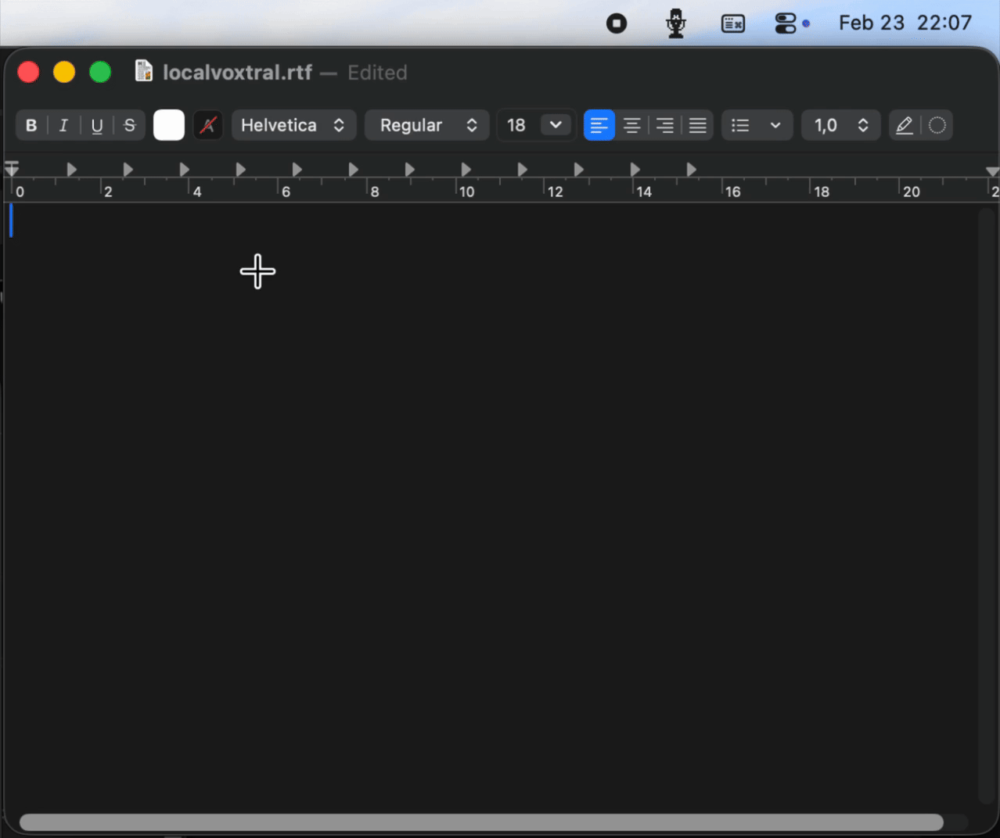
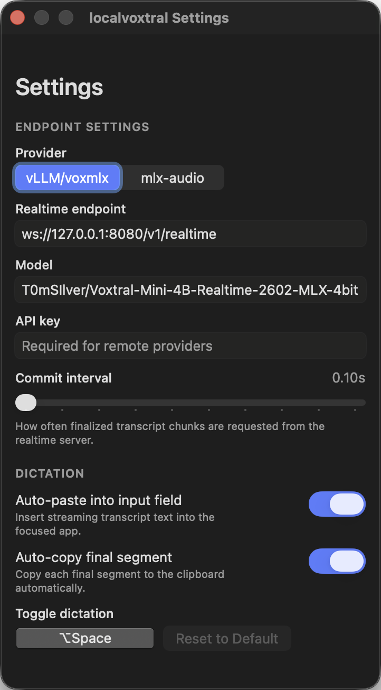

# localvoxtral

<p align="center">
  
</p>

<p align="center">
  
</p>

localvoxtral is a native macOS menu bar app for realtime dictation.
It keeps the loop simple: start dictation, speak, get text fast.
On Apple Silicon, `localvoxtral` + `voxmlx` provides a fully local path (audio + inference stay on-device), improving privacy and avoiding API costs.

It supports two realtime backend modes: OpenAI-Compatible Realtime API endpoints (`vLLM` and `voxmlx` share this path), and `mlx-audio` realtime transcription endpoints.

The app is geared towards the use of Mistral AI's [Voxtral Mini 4B Realtime](https://huggingface.co/mistralai/Voxtral-Mini-4B-Realtime-2602) model, but it works with any OpenAI-compatible Realtime API backend.

## Features

- User-configurable global shortcut to start/stop dictation from anywhere
- Native menu bar app with instant open and visual feedback with the icon
- Live dictation that writes into your active text field as you speak
- Fully local dictation option with `voxmlx` (no third-party API traffic)
- Pick your preferred microphone input device
- Copy the latest transcribed segment

## Quick start

Build and run as an app bundle (recommended):

```bash
./scripts/package_app.sh release
open ./dist/localvoxtral.app
```

## Settings

- Open **Settings** from the menu bar popover to set:
  - Dictation keyboard shortcut  
  - Realtime endpoint
  - Model name
  - API key
  - Commit interval (`vLLM`/`voxmlx`)
  - Transcription delay (`mlx-audio`)
  - Auto-paste into input field
  - Auto-copy final segment

## Screenshots

<p>
  <picture>
    <source media="(prefers-color-scheme: dark)" srcset="assets/icons/menubar/MicIconTemplate@2x_dark-preview.png" />
    
  </picture>
  Menubar icon
</p>

<p>
  
</p>

## Tested setup

In this tested setup, `vLLM` and `voxmlx` stream partial text fast enough for realtime dictation; latency and throughput will vary by hardware, model, and quantization.

### vLLM

[vllm](https://github.com/vllm-project/vllm) OpenAI Realtime-compatible server running on an NVIDIA RTX 3090, using the default settings recommended on the [Voxtral Mini 4B Realtime model page](https://huggingface.co/mistralai/Voxtral-Mini-4B-Realtime-2602).

```bash
VLLM_DISABLE_COMPILE_CACHE=1
vllm serve mistralai/Voxtral-Mini-4B-Realtime-2602 --compilation_config '{"cudagraph_mode": "PIECEWISE"}'
```

### voxmlx

[voxmlx](https://github.com/awni/voxmlx) OpenAI Realtime-compatible running on M1 Pro with a 4-bit quantized model. Use [this fork](https://github.com/T0mSIlver/voxmlx) which adds a WebSocket server that speaks the OpenAI Realtime API protocol and memory management optimizations.

```bash
git clone https://github.com/T0mSIlver/voxmlx.git
cd voxmlx
pip install -e ".[server]"
voxmlx-serve --model T0mSIlver/Voxtral-Mini-4B-Realtime-2602-MLX-4bit
```

### mlx-audio (deprecated)

**Deprecated:** `mlx-audio` does not provide true incremental inference for Voxtral Realtime, so partial transcripts are chunked and less responsive than the `vLLM` and `voxmlx` backends.

`mlx-audio` server on M1 Pro, running a [4-bit quant](https://huggingface.co/mlx-community/Voxtral-Mini-4B-Realtime-2602-4bit) of Voxtral Mini 4B Realtime. 

```bash
# Default max_chunk (6s) force-splits continuous speech mid-sentence; 30 lets silence detection handle segmentation naturally
MLX_AUDIO_REALTIME_MAX_CHUNK_SECONDS=30 python -m mlx_audio.server --workers 1
```

## Roadmap

- [ ] Enhance the server connection UX
- [ ] Drive `voxmlx-serve` (from the `voxmlx` fork) upstream and assess app-managed local serving (start/stop/config) in localvoxtral.
- [ ] Implement more of the on-device Voxtral Realtime integrations recommended in the model README:
  - [Pure C](https://github.com/antirez/voxtral.c) - thanks [Salvatore Sanfilippo](https://github.com/antirez)
  -  **done** ~~[mlx-audio framework](https://github.com/Blaizzy/mlx-audio) - thanks [Shreyas Karnik](https://github.com/shreyaskarnik)~~
  - **done** ~~[MLX](https://github.com/awni/voxmlx) - thanks [Awni Hannun](https://github.com/awni)~~
  - [Rust](https://github.com/TrevorS/voxtral-mini-realtime-rs) - thanks [TrevorS](https://github.com/TrevorS)
