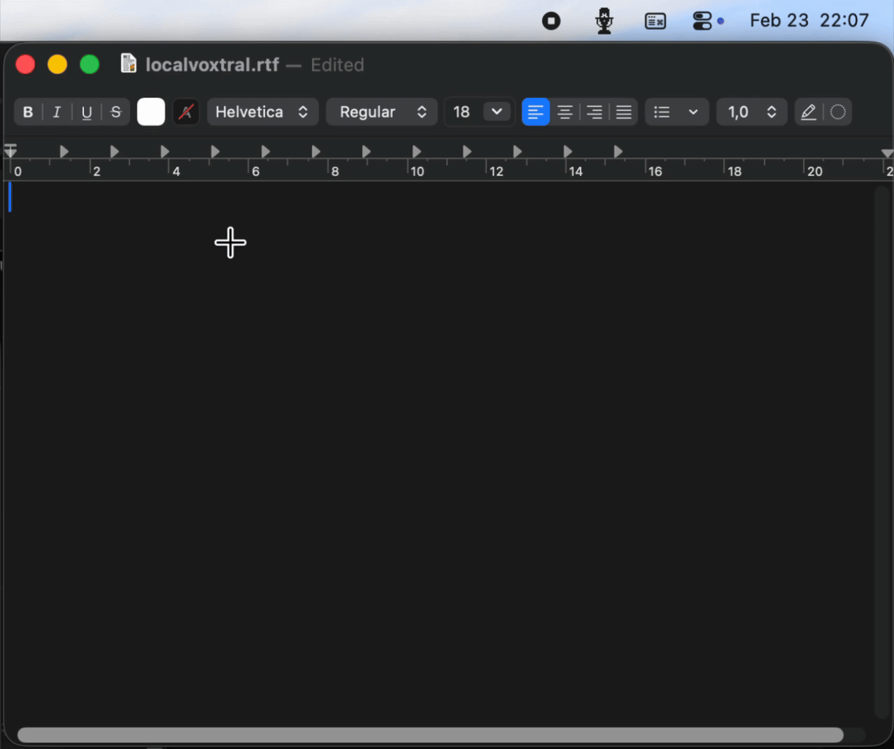
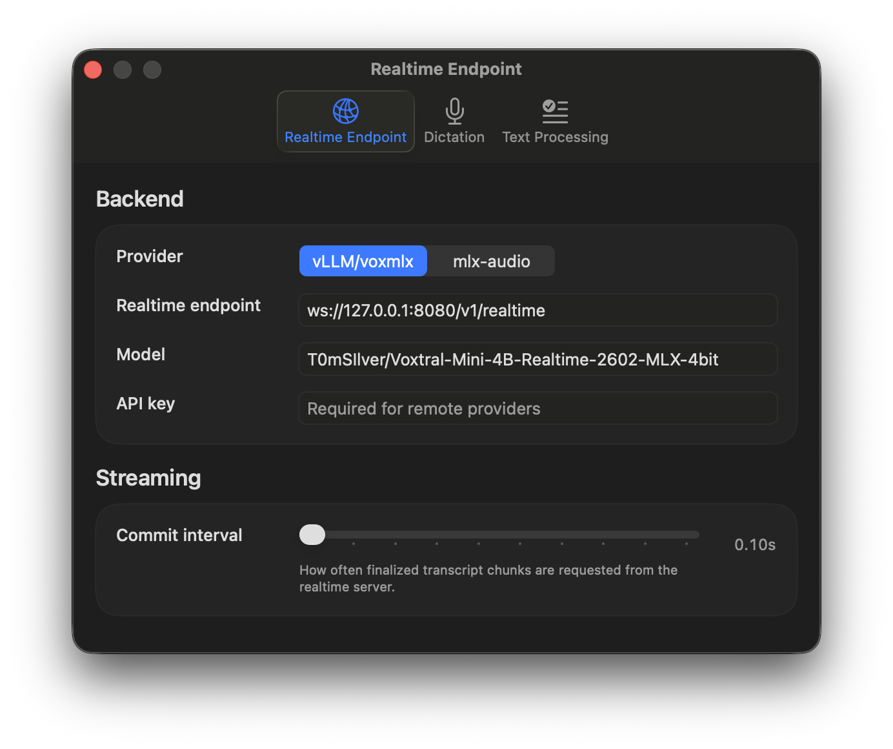
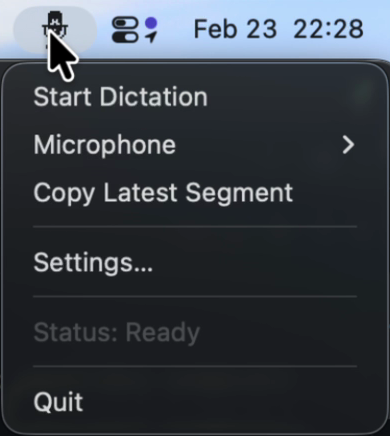

# localvoxtral

<p align="center">
  
</p>

<p align="center">
  
</p>

localvoxtral is a native macOS menu bar app for realtime dictation.
It keeps the loop simple: start dictation, speak, get text fast.
Unlike Whisper-based tools that transcribe after you stop speaking, Voxtral Realtime streams text as audio arrives, so words appear while you're still talking.
On Apple Silicon, `localvoxtral` + `voxmlx` + `mlx-lm` provides a fully local path (audio + inference + LLM polishing stay on-device), improving privacy and avoiding API costs.

It connects to any OpenAI Realtime-compatible endpoint. Recommended backends are `voxmlx` (Apple Silicon) and `vLLM` (NVIDIA GPU).
LLM Polishing connect to any OpenAI /chat/completions endpoint. The recommended backend is `mlx-lm` (Apple Silicon).

Built for Mistral AI's [Voxtral Mini 4B Realtime](https://huggingface.co/mistralai/Voxtral-Mini-4B-Realtime-2602) model, but it works with any OpenAI-compatible Realtime API backend and model.

## Features

- Global shortcuts: a single modifier key (tap for Overlay Buffer, hold for Live Auto-Paste) or per-mode keyboard shortcuts with `Toggle` / `Push to Talk` behavior
- Native menu bar app with instant open and visual feedback with the icon
- Output modes: overlay buffer (commit on stop) or live auto-paste into focused input
- Personal replacement dictionary (exact match or exact match + LLM-aware-replacement)
- Editable LLM system and user prompt templates
- Fully local dictation option with `voxmlx` (no third-party API traffic)
- Fully local LLM polishing option with `mlx-lm` (no third-party API traffic)
- Pick your preferred microphone input device
- Copy the latest transcribed segment

## Quick start

### Recommended: install from GitHub Releases (DMG)

Download the latest `.dmg` from [Releases](https://github.com/T0mSIlver/localvoxtral/releases/latest).

Releases are ad-hoc signed (not notarized). Depending on macOS version, first launch is either blocked with an **Open Anyway** button in **System Settings -> Privacy & Security**, or reported as "damaged". In both cases this clears the quarantine flag and the app opens normally:

```bash
xattr -cr /Applications/localvoxtral.app
```

### Alternatively, build from source as an app bundle

```bash
./scripts/package_app.sh release
open ./dist/localvoxtral.app
```

## Shortcuts

Two ways to trigger dictation, configured in **Settings -> Dictation**:

**Single modifier key** — Fn/Globe, Right Command, or Right Option. One key, two gestures:

| Gesture | Behavior |
|---|---|
| Tap | Toggle Overlay Buffer dictation on/off |
| Hold (past the hold delay, default 350 ms) | Live Auto-Paste push-to-talk — dictates while held, stops on release |

The gesture selects the output mode, so both workflows are always one key away. Pressing any other key while the modifier is down cancels the gesture, so regular keyboard combos are unaffected. Requires Accessibility permission.

**Per-mode keyboard shortcuts** — separate shortcuts for Overlay Buffer and Live Auto-Paste; behavior follows the `Toggle` / `Push to Talk` setting.

The **Output mode** setting applies to dictation started from the menu bar. Keyboard gestures and per-mode shortcuts select their mode directly.

**Escape** cancels an in-progress dictation.

## Settings

- Open **Settings** from the menu bar popover to set:
  - Dictation trigger: single modifier key (tap/hold) or per-mode keyboard shortcuts (`Toggle` / `Push to Talk`)
  - Backend mode (`Managed local` / `External URL`)
  - Realtime endpoint (URL, model name, API key)
  - Auto-copy final segment
  - Output mode (`Overlay Buffer` / `Live Auto-Paste`)
  - Replacement dictionary (overlay buffer output mode only)
  - LLM polishing endpoint (URL, model name, API key - overlay buffer output mode only)
  - Open the shared config folder for `replacement_dictionary.toml`, `llm_system_prompt.toml`, and `llm_user_prompt.toml`

The shared config directory lives at `~/Library/Application Support/localvoxtral/config`.

## Tested setup

### Managed local (default)

In Managed local mode, localvoxtral installs the pinned `voxmlx` and `mlx-lm` backend wheels automatically into `~/Library/Application Support/localvoxtral/backends` and starts them lazily on the first dictation request. App launch stays network-inert; downloads happen only when dictation starts in managed mode.

In this tested setup, `vLLM` and `voxmlx` stream partial text fast enough for realtime dictation; latency and throughput will vary by hardware, model, and quantization.

### External URL: voxmlx

[voxmlx](https://github.com/awni/voxmlx) OpenAI Realtime-compatible running on M1 Pro with a 4-bit quantized model. Use [this fork](https://github.com/T0mSIlver/voxmlx) which adds a WebSocket server that speaks the OpenAI Realtime API protocol and memory management optimizations.

```bash
# install uv once: https://docs.astral.sh/uv/getting-started/installation/
uvx --from "git+https://github.com/T0mSIlver/voxmlx.git[server]" \
  voxmlx-serve --model T0mSIlver/Voxtral-Mini-4B-Realtime-2602-MLX-4bit
```

### External URL: vLLM

[vllm](https://github.com/vllm-project/vllm) OpenAI Realtime-compatible server running on an NVIDIA RTX 3090, using the default settings recommended on the [Voxtral Mini 4B Realtime model page](https://huggingface.co/mistralai/Voxtral-Mini-4B-Realtime-2602).

```bash
VLLM_DISABLE_COMPILE_CACHE=1
vllm serve mistralai/Voxtral-Mini-4B-Realtime-2602 --compilation_config '{"cudagraph_mode": "PIECEWISE"}'
```

## Tested setup (LLM polishing)

### Managed local (default)

When LLM polishing is enabled in Managed local mode, localvoxtral starts the pinned `mlx-lm` backend lazily and points polishing at its local chat completions endpoint.

### External URL: mlx-lm

`mlx_lm.server` on M1 Pro, running [Qwen3.5-0.8B in 8 bit](https://huggingface.co/mlx-community/Qwen3.5-0.8B-MLX-8bit) for local LLM polishing.
Use [this fork](https://github.com/T0mSIlver/mlx-lm) which adds prompt caching optimizations.
Qwen3.5-0.8B is a lightweight default that adds little overhead while remaining smart enough for reliable polishing.

```bash
# install uv once: https://docs.astral.sh/uv/getting-started/installation/
# use prompt caching to avoid reprocessing the full conversation on every request
uvx --from "git+https://github.com/T0mSIlver/mlx-lm.git" mlx_lm.server \
  --model mlx-community/Qwen3.5-0.8B-8bit \
  --prompt-cache-size 1 \
  --prompt-cache-bytes 1GB
```

With the default polishing prompts, prompt processing is roughly 286 ms (~50%) faster on average on M1 Pro with my fork's enhanced prompt caching. On more powerful Apple Silicon, the absolute ms savings will likely be lower because prompt processing is faster.

## Roadmap

- [ ] Enhance the server connection UX
- [x] Drive `voxmlx-serve` (from the `voxmlx` fork) upstream and assess app-managed local serving (start/stop/config) in localvoxtral.
- [ ] Implement more of the on-device Voxtral Realtime integrations recommended in the model README:
  - [Pure C](https://github.com/antirez/voxtral.c) - thanks [Salvatore Sanfilippo](https://github.com/antirez)
  - **done** ~~[MLX](https://github.com/awni/voxmlx) - thanks [Awni Hannun](https://github.com/awni)~~
  - [Rust](https://github.com/TrevorS/voxtral-mini-realtime-rs) - thanks [TrevorS](https://github.com/TrevorS)

## UI

<p>
  <picture>
    <source media="(prefers-color-scheme: dark)" srcset="assets/icons/menubar/MicIconTemplate@2x_dark-preview.png" />
    
  </picture>
  Menubar icon
</p>

| Realtime Endpoint | Dictation |
| --- | --- |
|  |  |
| Text Processing | Popover |
|  |  |
