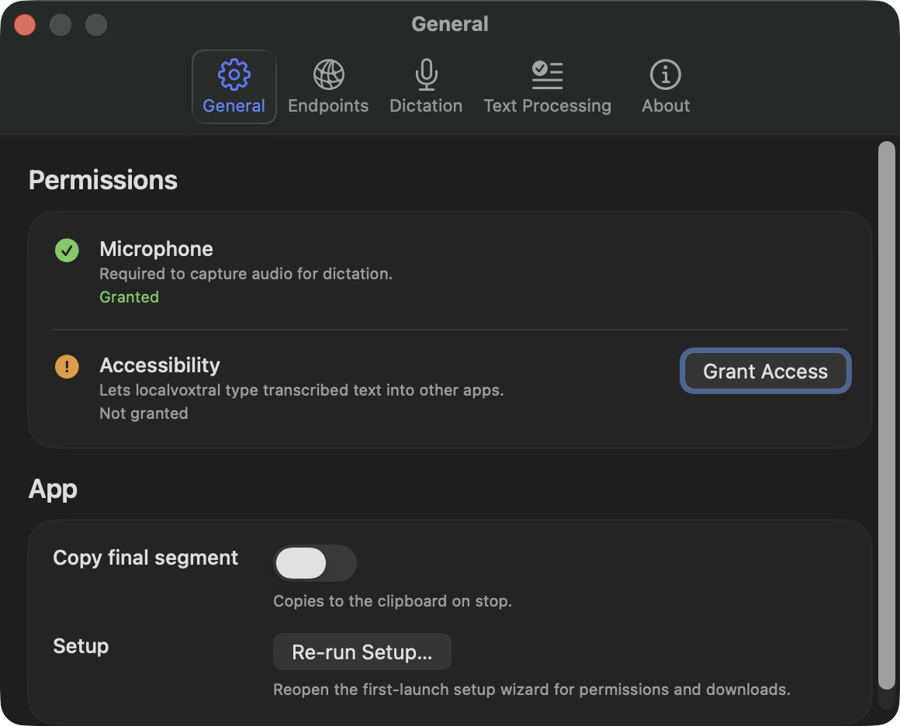
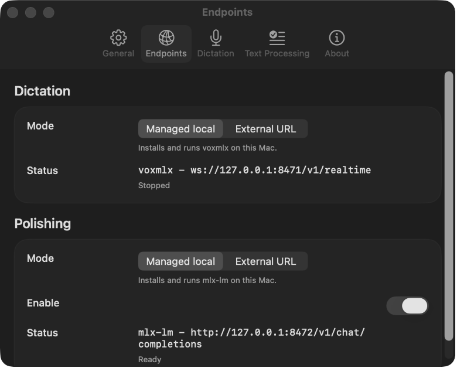
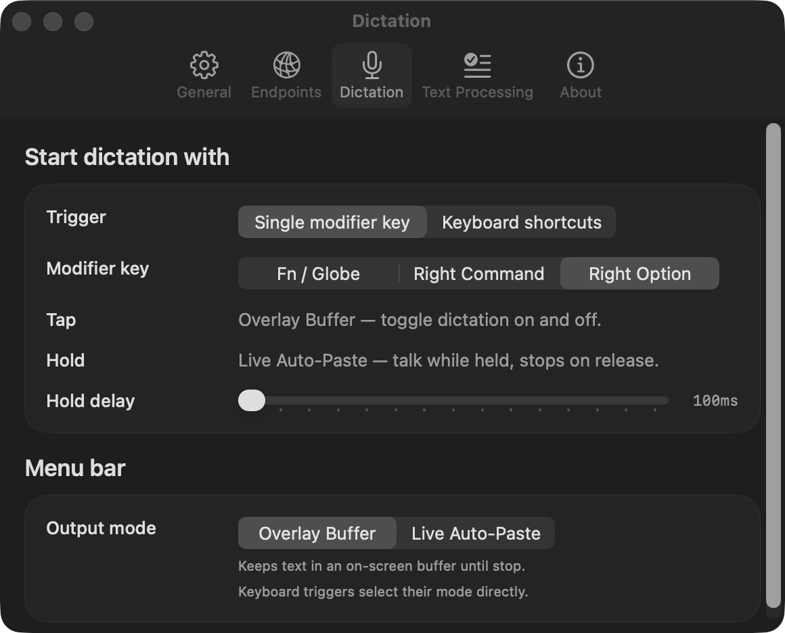
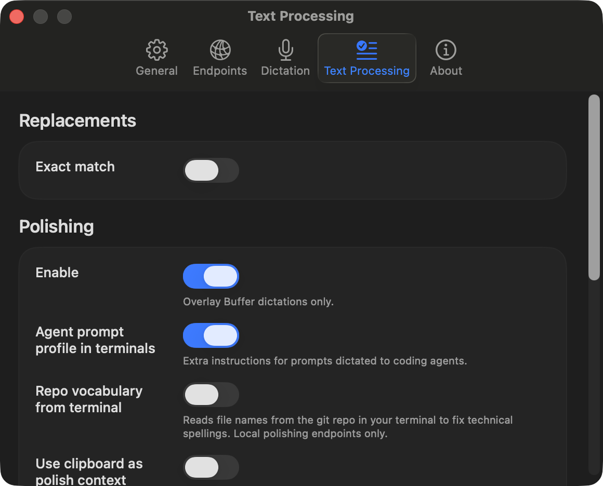

<h1 align="center">localvoxtral</h1>

<p align="center">
  
</p>

<p align="center">
  <strong>Talk to your coding agents. Keep every word on your Mac.</strong><br />
  Realtime, fully local dictation for the menu bar. Press a key and speak — your words appear while you're still talking.
</p>

<p align="center">
  <a href="https://github.com/T0mSIlver/localvoxtral/stargazers"></a>
  &nbsp;
  <a href="https://github.com/T0mSIlver/localvoxtral/releases/latest"></a>
  &nbsp;
  <a href="LICENSE"></a>
</p>

https://github.com/user-attachments/assets/81a341ff-0c53-4fcf-9b7f-ef148b24dfae

Unlike tools that transcribe after you stop speaking, localvoxtral streams text as the audio arrives, powered by Mistral AI's [Voxtral Mini 4B Realtime](https://huggingface.co/mistralai/Voxtral-Mini-4B-Realtime-2602) running on your own Apple Silicon. It is built first for [prompting coding agents by voice](#terminals--coding-agents), and it stays a solid general dictation app everywhere else. Everything runs on-device — no account, no subscription, nothing leaving your Mac (see [Privacy](#privacy)).

## Install

```bash
curl -fsSL https://raw.githubusercontent.com/T0mSIlver/localvoxtral/main/scripts/install.sh | bash
```

Or download the latest `.dmg` from [Releases](https://github.com/T0mSIlver/localvoxtral/releases/latest).

On first launch, a setup wizard walks you through the microphone and Accessibility permissions and downloads the local engine with live progress. Dictate the moment it finishes. You can re-run the wizard any time from Settings.

> [!NOTE]
> **Requirements:** an Apple Silicon Mac running macOS 15 or later.

> [!IMPORTANT]
> Releases are ad-hoc signed, not notarized yet (see [Roadmap](#roadmap)). The installer script handles Gatekeeper for you. If you install the DMG by hand and macOS blocks or stalls the first launch ("damaged", **Open Anyway**, or a hang on macOS 26), clear the quarantine flag:
> ```bash
> xattr -cr /Applications/localvoxtral.app
> ```

## Features

- **Built for coding agents** — terminals are first-class targets and polishing understands developer speech ([details](#terminals--coding-agents))
- **Claude Code aware** — dictation joins the *exact* session under your cursor — Ghostty, iTerm2, Terminal.app, even a single [herdr](https://herdr.dev) pane — and grounds polishing in its live screen, your last prompt, the files Claude just touched, and that repo, locally or over SSH ([details](#dictating-into-claude-code))
- **One-key dictation** — a single modifier key (Fn/Globe, Right Command, or Right Option) drives both modes, or use classic per-mode keyboard shortcuts ([details](#shortcuts))
- **Two output modes** — Overlay Buffer (review, then commit on stop) or Live Auto-Paste (words land in the focused app while you speak)
- **Automatic cleanup** — an exact-match replacement dictionary in both output modes, plus optional LLM polishing with editable prompts when an Overlay Buffer dictation commits
- **Bring your own server** — dictation and polishing can each point at any OpenAI-compatible endpoint instead of the built-in local engines
- **Menu bar native** — instant popover with dictation status at a glance, microphone picker, auto-copy of the final text, and the raw transcript one click away after a polished commit
- **Multilingual** — dictate in English, French, or any other language [Voxtral](https://huggingface.co/mistralai/Voxtral-Mini-4B-Realtime-2602) understands; polishing answers in the language you spoke (English and French are covered by the test suite)

> [!TIP]
> If localvoxtral is useful to you, a ⭐ on this repo helps others find it.

## Privacy

In the default Managed local mode, nothing you say or write is sent anywhere. Audio capture, transcription, and LLM polishing all run as local processes on your Mac, and the only network traffic is the one-time engine and model download. There is no telemetry, no account, and no cloud fallback. The context-aware polishing features (Claude Code session context, repo vocabulary, clipboard context) are opt-in and by default only ever talk to a loopback polishing endpoint — a non-local endpoint receives context only if you additionally enable the explicit trusted-endpoint opt-in (default off). If you point localvoxtral at your own External URL server instead, your data goes only where you send it.

## Shortcuts

Two ways to trigger dictation, configured in **Settings → Dictation**:

**Single modifier key** — Fn/Globe, Right Command, or Right Option. One key, two gestures:

| Gesture | Behavior |
|---|---|
| Tap | Toggle Overlay Buffer dictation on/off |
| Hold (past the hold delay, default 350 ms) | Live Auto-Paste push-to-talk — dictates while held, stops on release |

The gesture selects the output mode, so both workflows are always one key away. A tap commits through optional LLM polishing, while a hold streams words in real time (the replacement dictionary applies in both). Pressing any other key while the modifier is down cancels the gesture, so regular keyboard combos involving the modifier are unaffected. Requires Accessibility permission.

**Per-mode keyboard shortcuts** — separate shortcuts for Overlay Buffer and Live Auto-Paste; behavior follows the `Toggle` / `Push to Talk` setting.

**Escape** cancels an in-progress dictation.

## Terminals & coding agents

Most dictation tools fall apart in a terminal. localvoxtral treats it as its primary target: prompt Claude Code — or any CLI coding agent — by voice and watch the words stream in live. SSH sessions work too, since text is typed into your local terminal. Terminal apps are detected automatically (Terminal, iTerm2, Ghostty, Warp, WezTerm, kitty, Alacritty, Hyper, Tabby, Rio, and more), and apps that embed a terminal can be added in `terminal_apps.toml`. Live dictation adapts:

- **Prompt-safe output** — newlines and tabs are typed as spaces, so a stray line break never submits a half-finished prompt and a tab never triggers shell completion
- **Replacements without rewriting** — dictionary replacements are applied before text is typed; localvoxtral never backspaces over what the terminal has already drawn
- **Secure input handling** — if Secure Keyboard Entry is active (a `sudo` password prompt, say), a live session refuses to start instead of typing into the void, and an overlay commit falls back to copying the text to the clipboard

When an Overlay Buffer dictation commits, optional LLM polishing understands how developers talk:

- **Agent prompt profile** (on by default) — when the target is a terminal, polishing switches to an agent-tuned prompt. Spoken symbol forms become written ones ("dash dash force" → `--force`, "src slash auth" → `src/auth`, "the dot env file" → `.env`), code-like tokens (and only those) get backticks, filler words are stripped, self-corrections resolve to the final intent, and explicit enumerations become lists
- **Model-first polishing** — polishing trusts the model's final wording and technical formatting, so useful Markdown and reconstructed identifiers survive
- **Repo vocabulary** (opt-in) — the focused repo (found from the tab title, or from a joined Claude Code session's own working directory) is indexed with a single sandboxed `git ls-files`, and up to 12 relevant terms reach the polisher, so "use auth dot t s" comes out as `useAuth.ts`. An ambiguous repo safely sends no hints, and only high-confidence, boundary-checked matches are corrected in the working text — everything else stays a hint, never a rewrite of the model's output
- **Clipboard as context** (opt-in) — the polisher sees a sanitized excerpt of your clipboard to ground technical spellings
- **"Paste clipboard" macro** (on by default) — say it mid-dictation and the clipboard content is embedded as a code block when the text commits

The overlay shows a **Polished** badge whenever the LLM touched your text, and the raw transcript stays one click away in the menu bar popover.

### Dictating into Claude Code

localvoxtral ships a [Claude Code plugin](integrations/claude-code/README.md) that turns dictation into a session-aware input method. The plugin is hooks-only — it spends none of your tokens, adds nothing to Claude's context, and cannot slow a turn down (every hook fails open if the app isn't running). What it does is tell localvoxtral what your session is doing, so that when you dictate into that session, polishing is grounded in:

- the session's **visible screen** — the exact pane you're dictating into, so what you and Claude are both looking at grounds what you say
- your **previous prompt** and the session's **working directory**
- the **files Claude just read or edited** — exactly the identifiers you're most likely to say next
- that repository's **vocabulary** (via the repo-vocabulary index above, using the session's own reported directory — no tab-title guessing)

The result is dictation that gets the hard part right: the misheard `useAuth.ts`, the branch name you mentioned two turns ago, the flag Claude just wrote into a file.

Here it is inside a [herdr](https://herdr.dev) multiplexer — the join binds to the exact Claude pane and grounds the dictation in that pane's screen, while the neighboring pane stays out of the prompt:

<!-- herdr demo video: recorded by record-demo.yml (terminal_agent=herdr); regenerate via that workflow and replace the URL below. -->
HERDR_DEMO_VIDEO_URL_PLACEHOLDER

Install is one click: **Settings → Text Processing → Claude Code plugin → Install**. The app registers its bundled plugin marketplace through Claude Code's own CLI and never edits `~/.claude/settings.json` behind your back.

**Working over SSH?** A second plugin, `localvoxtral-remote`, covers Claude Code sessions on other machines: its hooks POST through an SSH `RemoteForward` back to your Mac — nothing to install on the host beyond the plugin's two JSON files, authenticated by a per-host token you can rotate or revoke in Settings at any time. Remote context is bounded and opaque by construction: labels and short sanitized excerpts only, and the app never reaches into the remote filesystem.

Privacy, in one line: an allowlist of session metadata crosses a private local socket; transcripts, file contents, and shell commands never do. The [plugin README](integrations/claude-code/README.md) documents the exact fields and the threat model.

> [!NOTE]
> **Session joins work in Ghostty (≥ 1.4, today the [tip channel](https://ghostty.org/docs/install/pre)), iTerm2, and Terminal.app.** localvoxtral asks the terminal itself for the focused pane's TTY and matches it exactly against the session's — and inside a [herdr](https://herdr.dev) multiplexer, the join binds to the precise pane and reads its screen from herdr directly, so neighboring panes never leak into your prompt. Joins are exact-or-nothing: any ambiguity attaches no context at all. On stable (pre-1.4) Ghostty, an opt-in **window-title marker fallback** is available — the [plugin README](integrations/claude-code/README.md) covers its setup. First use asks for one Automation permission per terminal.

## Settings

Open **Settings** from the menu bar popover:

- **General** — permission status for Microphone and Accessibility (with grant buttons), copy-final-segment toggle, and Re-run Setup
- **Endpoints** — Dictation and Polishing each switch independently between `Managed local` (a model picker for polishing, plus a status light) and `External URL` (endpoint URL, model name, API key)
- **Dictation** — the trigger (single modifier key with tap/hold gestures, or per-mode keyboard shortcuts) and the menu-bar output mode
- **Text Processing** — exact-match replacements, plus the LLM Polishing switch and its agent-dictation features (agent prompt profile, repo vocabulary, clipboard context, spoken clipboard paste, and Claude Code session context)
- **About** — version, link to this repository, and Export Diagnostics (writes a redacted local report to the Desktop)

The config folder at `~/Library/Application Support/localvoxtral/config` holds `replacement_dictionary.toml`, the LLM prompt TOMLs (including the agent variants), and `terminal_apps.toml`. When an update ships improved defaults, files you haven't edited are refreshed automatically; files you have edited are never touched without asking — the app offers to update them and keeps your versions as `.backup` files alongside.

## Under the hood

In **Managed local** mode (the default), localvoxtral launches and supervises two inference engines for you — no terminal required:

- **Dictation — `localvoxtral-speechd`**, a bundled Swift helper built on [mlx-audio-swift](https://github.com/Blaizzy/mlx-audio-swift), streams [Voxtral Mini 4B Realtime in 4-bit with a quantized LM head](https://huggingface.co/T0mSIlver/Voxtral-Mini-4B-Realtime-2602-4bit-qhead) through the app's OpenAI Realtime-compatible server. The checkpoint is a conversion of the mlx-community 4-bit snapshot that also quantizes the tied output head — cutting the decode loop's largest projection from ~30 ms to ~3 ms per token and saving ~530 MB of memory, at level transcription quality.
- **Polishing — `localvoxtral-polishd`**, a bundled Swift helper built on Apple's [MLX Swift](https://github.com/ml-explore/mlx-swift-lm), runs [Qwen3.5-4B-OptiQ in 4-bit](https://huggingface.co/mlx-community/Qwen3.5-4B-OptiQ-4bit) by default (a lighter 0.8B and a larger 9B are one click away in Settings). A warm prompt cache keeps polish latency low, and turning polishing off frees its memory immediately.

Both helpers ship inside the app bundle. Their model weights download from Hugging Face at exact pinned commits, so an upstream edit to a model repo can never change what your install runs. The app supervises both helpers, and a watchdog stops them even if the app crashes. Transcription-and-polish quality is held by a nightly end-to-end eval — real audio through the production ASR and polishing path, scored against an agent-dictation corpus of ~160 cases — so a model or prompt change that regresses dictation gets caught before it ships.

Prefer your own hardware? Switch Dictation or Polishing to **External URL** in **Settings → Endpoints**: any OpenAI Realtime-compatible server works for dictation, any chat-completions server for polishing.

<details>
<summary>Example: Voxtral Realtime on vLLM (NVIDIA GPU)</summary>

```bash
VLLM_DISABLE_COMPILE_CACHE=1
vllm serve mistralai/Voxtral-Mini-4B-Realtime-2602 --compilation_config '{"cudagraph_mode": "PIECEWISE"}'
```

The settings recommended on the [model page](https://huggingface.co/mistralai/Voxtral-Mini-4B-Realtime-2602), tested against an NVIDIA RTX 3090.

</details>

## Build from source

```bash
./scripts/package_app.sh release
open ./dist/localvoxtral.app
```

## Screenshots

<!-- Regenerate the screenshots below with the "Capture README Assets" workflow (Actions -> capture-assets.yml, run on the branch) or ./scripts/capture-readme-assets.sh on a Mac. Captures are pinned to dark mode for consistency. The demo video is recorded with ./scripts/record-demo.sh (operator speaks the prompted lines) or hands-free via the "Record README Demo" workflow (record-demo.yml, TTS through BlackHole on the self-hosted runner); GitHub only renders inline video from user-attachments URLs, so the resulting mp4 is drag-dropped into a PR comment by hand and the URL pasted after the badges on its own line. -->

<p>
  <picture>
    <source media="(prefers-color-scheme: dark)" srcset="assets/icons/menubar/MicIconTemplate@2x_dark-preview.png" />
    
  </picture>
  Menubar icon
</p>

<table>
  <tr>
    <td width="50%" align="center"><b>General</b></td>
    <td width="50%" align="center"><b>Endpoints</b></td>
  </tr>
  <tr>
    <td width="50%"></td>
    <td width="50%"></td>
  </tr>
  <tr>
    <td width="50%" align="center"><b>Dictation</b></td>
    <td width="50%" align="center"><b>Text Processing</b></td>
  </tr>
  <tr>
    <td width="50%"></td>
    <td width="50%"></td>
  </tr>
</table>

## Roadmap

- [ ] Developer ID signing + notarization — install with no Gatekeeper workarounds
- [ ] Hotword boosting in the speech model itself — bias transcription (not only polishing) toward your repo's vocabulary
- [ ] Claude Code session joins on more terminals — WezTerm is next; tmux/cmux support
- [ ] Documentation website — a visual, end-user guide beyond this README
- [ ] More streaming ASR models beyond Voxtral Realtime — e.g. [NVIDIA Nemotron 3.5 ASR Streaming 0.6B](https://huggingface.co/nvidia/nemotron-3.5-asr-streaming-0.6b)

## License

[MIT](LICENSE)
