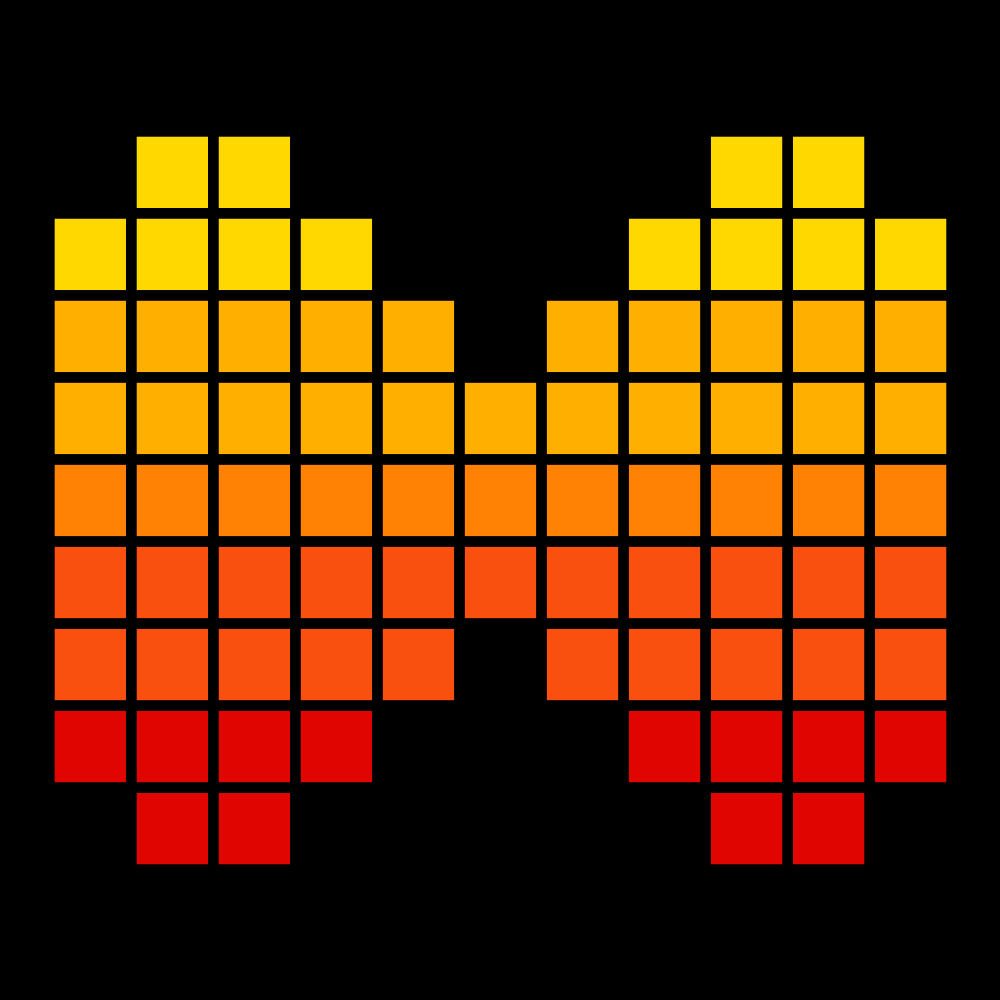

<h1 align="center">localvoxtral</h1>

<p align="center">
  
</p>

<p align="center">
  <strong>Talk to your coding agents. Keep every word on your Mac.</strong><br />
  Realtime, fully local dictation for the menu bar. Press a key and speak. Your words appear while you're still talking.
</p>

<p align="center">
  <a href="#install">Install</a> ·
  <a href="https://t0msilver.github.io/localvoxtral/docs/">Documentation</a> ·
  <a href="https://t0msilver.github.io/localvoxtral/docs/coding-agents/">Coding agents</a> ·
  <a href="CONTRIBUTING.md">Contributing</a>
</p>

<p align="center">
  <a href="https://github.com/T0mSIlver/localvoxtral/stargazers"></a>
  &nbsp;
  <a href="https://github.com/T0mSIlver/localvoxtral/releases/latest"></a>
  &nbsp;
  <a href="LICENSE"></a>
</p>

https://github.com/user-attachments/assets/81a341ff-0c53-4fcf-9b7f-ef148b24dfae

localvoxtral streams text as the audio arrives instead of transcribing after you stop speaking. It runs Mistral AI's [Voxtral Mini 4B Realtime](https://huggingface.co/mistralai/Voxtral-Mini-4B-Realtime-2602) on your own Apple Silicon.

It is built first for [prompting coding agents by voice](https://t0msilver.github.io/localvoxtral/docs/coding-agents/), and it works as a general dictation app in any other app too. Everything runs on-device, with no account and no subscription. Nothing leaves your Mac unless you point it at a server yourself.

## Install

```bash
curl -fsSL https://raw.githubusercontent.com/T0mSIlver/localvoxtral/main/scripts/install.sh | bash
```

Or install with Homebrew:

```bash
brew install --cask T0mSIlver/localvoxtral/localvoxtral
```

You can also download the latest DMG from [Releases](https://github.com/T0mSIlver/localvoxtral/releases/latest). localvoxtral needs an Apple Silicon Mac on macOS 15 or later.

On first launch, a setup wizard asks for permissions and downloads the engine.

## Features

- **Jump to the agent that needs you.** When one of your coding agents waits for an answer, localvoxtral tells you. Press Tab while you dictate, and that agent's pane comes to the front so you can read its question while you answer. Your words go there ([details](https://t0msilver.github.io/localvoxtral/docs/agents/)).
- **Built for coding agents.** Dictate prompts straight into any CLI agent ([opencode](https://t0msilver.github.io/localvoxtral/integrations/opencode/), [Mistral Vibe](https://t0msilver.github.io/localvoxtral/integrations/vibe/) and [Codex](https://t0msilver.github.io/localvoxtral/integrations/codex/) get their own integrations), in any terminal: Warp, WezTerm, kitty, Alacritty, and more. Polishing understands developer speech: "dash dash force" becomes `--force`, "use auth dot t s" becomes `useAuth.ts` ([details](https://t0msilver.github.io/localvoxtral/docs/coding-agents/)).
- **Claude Code aware.** Dictation joins the exact session under your cursor: Ghostty, iTerm2, Terminal.app, a single [herdr](https://herdr.dev) or [cmux](https://github.com/manaflow-ai/cmux) pane, over SSH, or a [claude.ai/code](https://claude.ai/code) Remote Control tab in your browser. Polishing is grounded in that session's screen, your last prompt, the files Claude just touched, and the repo's vocabulary ([details](https://t0msilver.github.io/localvoxtral/docs/coding-agents/#dictating-into-claude-code)).
- **One key.** Tap or hold to dictate into an overlay you can review, with optional LLM polishing. Press Tab to save the words to your Inbox instead ([shortcuts](https://t0msilver.github.io/localvoxtral/docs/dictation/)).
- **Private.** Audio capture, transcription and polishing run on your Mac. No telemetry, no account, no cloud fallback ([how it works](https://t0msilver.github.io/localvoxtral/docs/under-the-hood/)).
- **Menu bar native.** The popover shows dictation status and a microphone picker. The app can copy the final text for you, and after a polished commit the raw transcript is one click away.
- **Bring your own server.** Dictation and polishing can each point at any OpenAI-compatible endpoint, or at Mistral's hosted API with one key, instead of the built-in local engines ([details](https://t0msilver.github.io/localvoxtral/docs/under-the-hood/#bring-your-own-server)).
- **Multilingual.** Dictate in English, French, or any language [Voxtral](https://huggingface.co/mistralai/Voxtral-Mini-4B-Realtime-2602) understands. Polishing answers in the language you spoke (English and French are covered by the test suite).

> [!TIP]
> If localvoxtral is useful to you, a ⭐ on this repo helps others find it.

## Documentation

Every guide is listed in the [documentation index](https://t0msilver.github.io/localvoxtral/docs/).

## License

[MIT](LICENSE)
