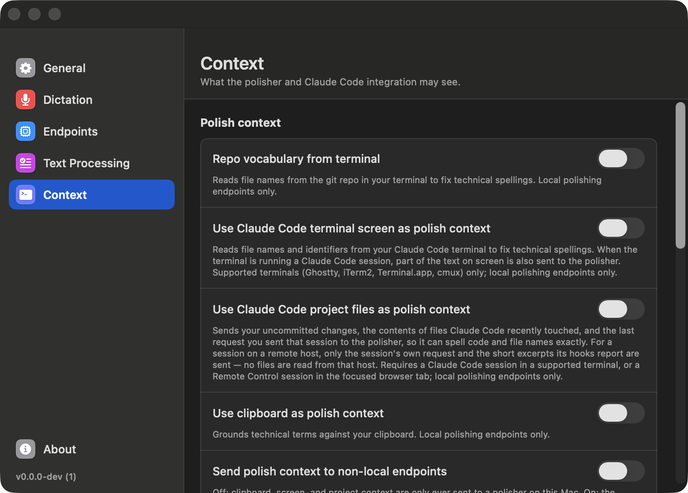

# Dictating: shortcuts, output modes, and settings

## Shortcuts

Two ways to trigger dictation, configured in **Settings → Dictation**:

**Single modifier key** — Fn/Globe, Right Command, or Right Option. One key,
two gestures:

| Gesture | Behavior |
|---|---|
| Tap | Toggle Overlay Buffer dictation on/off |
| Hold (past the hold delay, default 350 ms) | Live Auto-Paste push-to-talk — dictates while held, stops on release |

The gesture selects the output mode, so both workflows are always one key
away. A tap commits through optional LLM polishing, while a hold streams
words in real time (the replacement dictionary applies in both). Pressing any
other key while the modifier is down cancels the gesture, so regular keyboard
combos involving the modifier are unaffected. Requires Accessibility
permission.

**Per-mode keyboard shortcuts** — separate shortcuts for Overlay Buffer and
Live Auto-Paste; behavior follows the `Toggle` / `Push to Talk` setting.

**Escape** cancels an in-progress dictation.

## Output modes

- **Overlay Buffer** — your words collect in a floating overlay while you
  speak; on stop, the text runs through the replacement dictionary and
  optional LLM polishing, then commits into the focused app. The overlay
  shows a **Polished** badge whenever the LLM touched your text, and the raw
  transcript stays one click away in the menu bar popover.
- **Live Auto-Paste** — words land in the focused app while you're still
  talking. Dictionary replacements are applied before text is typed;
  localvoxtral never backspaces over what an app has already drawn.

## The menu bar popover

localvoxtral lives in the menu bar: the popover shows dictation status at a
glance, a **microphone picker**, an auto-copy toggle for the final text, and
— after a polished commit — the raw transcript one click away. LLM polishing
prompts are editable (see the config folder below).

## Settings

Open **Settings** from the menu bar popover:

- **General** — permission status for Microphone and Accessibility (with
  grant buttons), copy-on-stop toggle, and Re-run setup
- **Engines** — Dictation and Polishing each switch independently between
  `Managed local` (a model picker for polishing, plus a status light) and
  `External URL` (server URL, model name, API key). Dictation accepts an
  OpenAI Realtime-compatible endpoint. For polishing, enter either a base URL
  such as `http://127.0.0.1:8080` or the full chat completions URL; the app
  appends `/v1/chat/completions` to a base URL. Lower dictation step intervals
  show words sooner, while higher values use less compute.
- **Dictation** — the trigger (single modifier key with tap/hold gestures, or
  per-mode keyboard shortcuts) and the menu-bar output mode
- **Text Processing** — exact-match replacements, plus the LLM Polishing
  switch, the agent prompt profile, and spoken clipboard paste
- **Integrations** — what the polisher may see (repo vocabulary, terminal
  screen, Claude Code project files, clipboard), one row per harness with
  in-app setup: the Claude Code plugin and status line, remote SSH hosts, the
  opencode plugin, and herdr presence. Each row's help is one line naming
  what leaves this Mac; the full terms per toggle are in
  [Terminals & coding agents](coding-agents.md#polish-context-what-each-toggle-sends),
  and each group's **Learn more** link opens the relevant page
- **About** — version, link to the repository, and Export Diagnostics
  (writes a redacted local report to the Desktop)

The config folder at `~/Library/Application Support/localvoxtral/config`
holds `replacement_dictionary.toml` for both output modes; the standard and
agent `llm_system_prompt*.toml` and `llm_user_prompt*.toml` files; and
`terminal_apps.toml` for extra terminal apps. Remove
`{{replacement_dictionary}}` from a user prompt template to stop sending the
dictionary to the LLM. When an update ships improved
defaults, files you haven't edited are refreshed automatically; files you
have edited are never touched without asking — the app offers to update them
and keeps your versions as `.backup` files alongside.

## Screenshots

<!-- Regenerate the screenshots below with the "Capture README Assets" workflow (Actions -> capture-assets.yml, run on the branch) or ./scripts/capture-readme-assets.sh on a Mac. Captures are pinned to dark mode for consistency. The demo video is recorded with ./scripts/record-demo.sh (operator speaks the prompted lines) or hands-free via the "Record README Demo" workflow (record-demo.yml, TTS through BlackHole on the self-hosted runner); GitHub only renders inline video from user-attachments URLs, so the resulting mp4 is drag-dropped into a PR comment by hand and the URL pasted into the README/docs by hand. -->

  <picture>
    <source media="(prefers-color-scheme: dark)" srcset="../assets/icons/menubar/MicIconTemplate@2x_dark-preview.png" />
    
  </picture>
  Menubar icon

<table>
  <tr>
    <td width="50%" align="center"><b>General</b></td>
    <td width="50%" align="center"><b>Engines</b></td>
  </tr>
  <tr>
    <td width="50%"></td>
    <td width="50%"></td>
  </tr>
  <tr>
    <td width="50%" align="center"><b>Dictation</b></td>
    <td width="50%" align="center"><b>Text Processing</b></td>
  </tr>
  <tr>
    <td width="50%"></td>
    <td width="50%"></td>
  </tr>
  <tr>
    <td width="50%" align="center"><b>Integrations</b></td>
    <td width="50%"></td>
  </tr>
  <tr>
    <td width="50%"></td>
    <td width="50%"></td>
  </tr>
</table>
