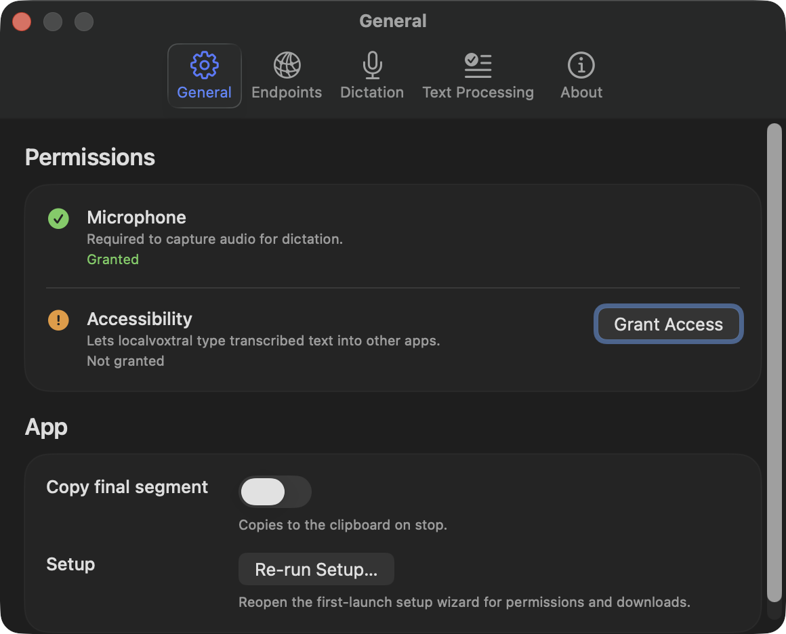
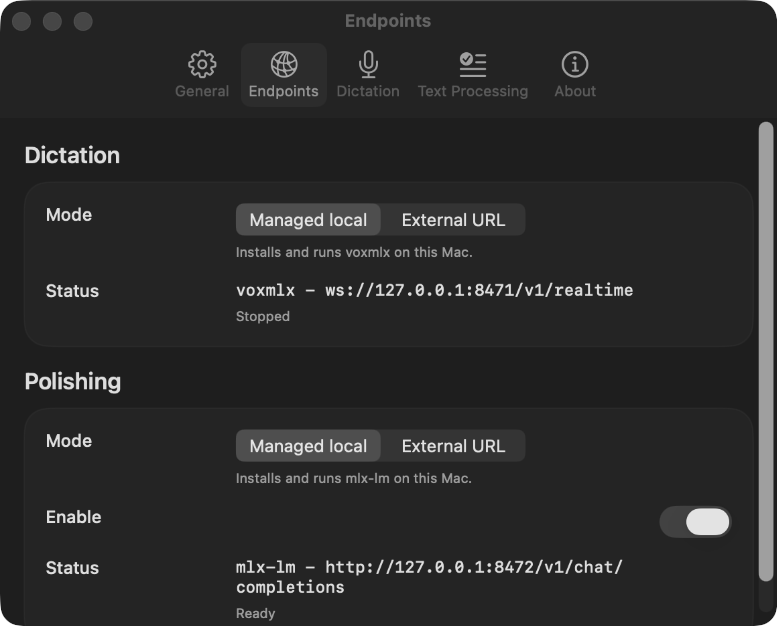
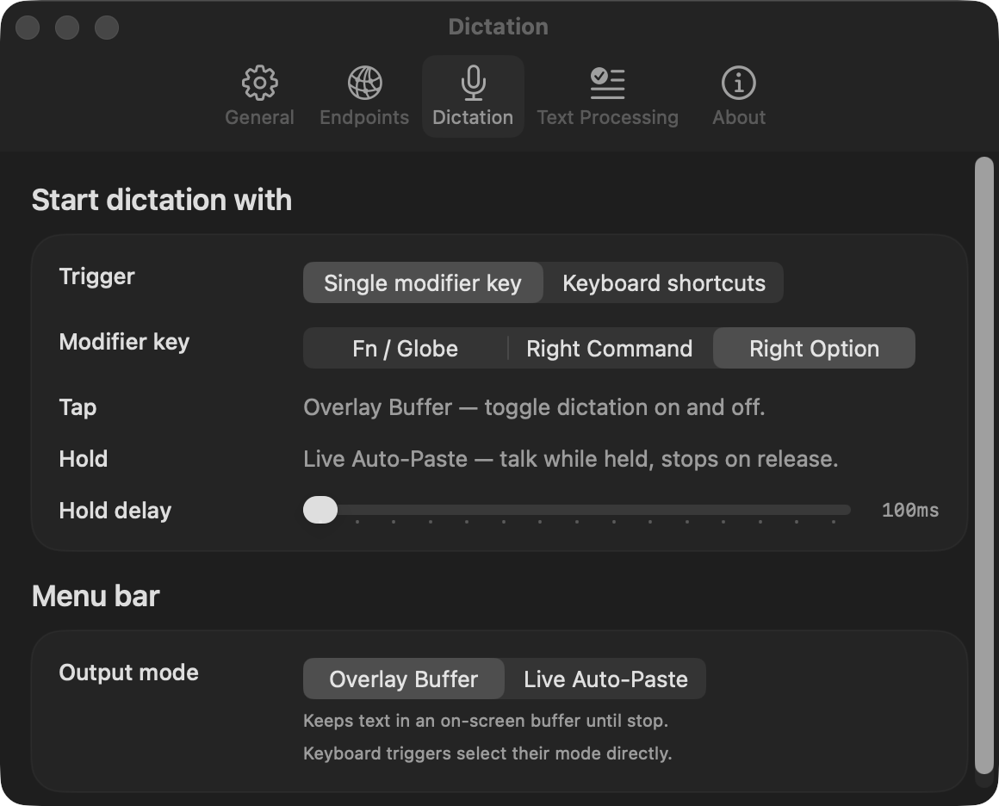
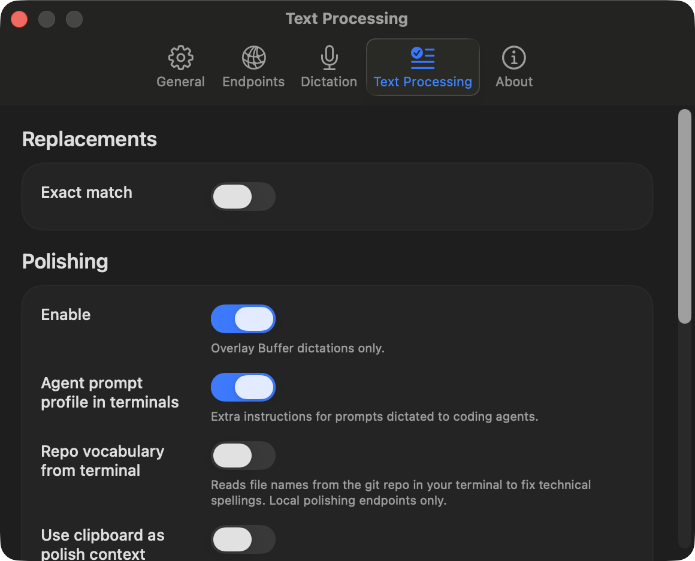
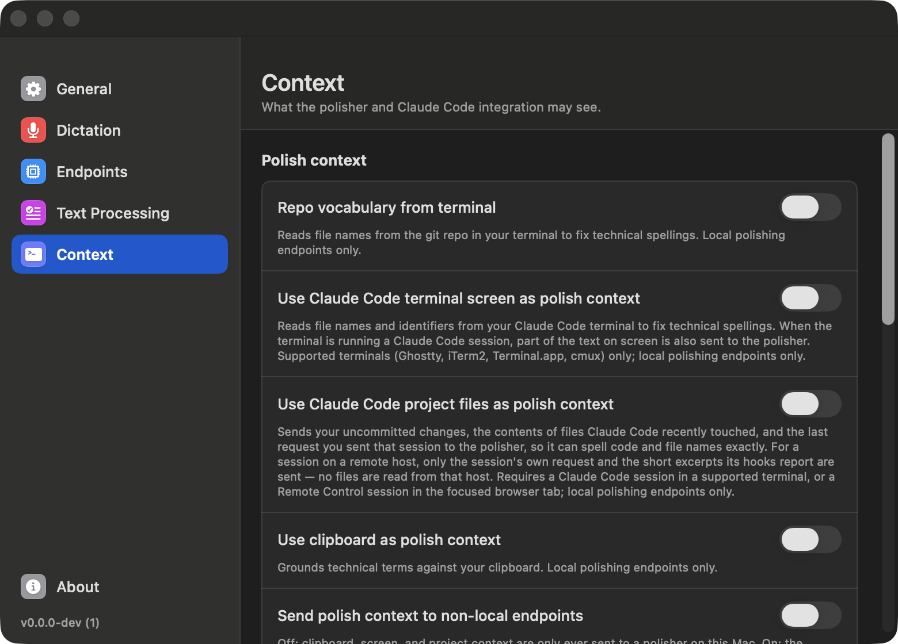

# Dictating

Dictate into any app with one key, send the words to a coding agent
session or the Inbox, and teach localvoxtral the names you say. Every
setting is listed at the end, under [Settings](#settings).

## Shortcuts

One key dictates. You pick it in **Settings → Dictation**, as one of two
triggers.

**Modifier keys.** Fn/Globe, Right Command, Right Option, or a chord: two
modifier keys or more pressed together, such as left Shift and right Shift.
Left Shift and right Shift is the chord until you record another under
**Chord keys**. This trigger needs Accessibility permission.

| Gesture | Behavior |
|---|---|
| Tap | Start an Overlay Buffer dictation; tap again to stop |
| Hold (past the hold delay, default 350 ms) | Dictate while held; letting go stops |

Pressing any other key while the modifier is down cancels the gesture. Your
usual shortcuts with that modifier therefore still work.

A chord counts only when its keys go down within 100 ms of each other, so
holding one Shift while typing never starts a dictation. The hold delay
starts once the last key of the chord is down, and a hold ends as soon as one
of them goes up.

**Keyboard shortcut.** You record one dictation shortcut, and the **Toggle**
or **Push to Talk** setting decides how it behaves. A shortcut needs at least
one modifier, except for a function key.

F1 to F20 can be recorded on their own, so a spare F13 to F20 on a full-size
keyboard makes a dedicated dictation key. F1 to F12 are accepted too, but
macOS uses those presses for brightness and media. The app never sees them
until **Use F1, F2, etc. keys as standard function keys** is on in System
Settings.

**Escape** cancels an in-progress dictation.

### Record a chord of modifier keys

Three optional shortcuts can also be a chord of modifier keys, such as left
Shift and right Shift together: **Answer the agent that needs you**, **Quick
capture to Inbox** and **Copy last dictation**. A chord needs Accessibility
permission. One chord does one job: the dictation key's chord can't also be
one of these.

1. Click the shortcut's field.
2. Press the keys together.
3. Let go.

The chord fires when you let go. It fires only if its keys went down within
100 ms of each other with no other key pressed in between, so holding one
Shift while typing never fires it.

## Choose an output mode

**Overlay Buffer** collects your words in a floating overlay and commits them
when you stop. **Live Auto-Paste** types them into the focused app while you
talk.

### Overlay Buffer

Your words collect in a floating overlay while you speak. When you stop, the
text goes through the replacement dictionary and optional LLM polishing,
then commits into the focused app.

The overlay shows a **Polished** badge when the LLM changed your text. The
menu bar popover keeps the raw transcript.

To move the overlay, drag it by any part to a spot of your choice. It stays
there across restarts. To anchor it to the focused window again, double-click
it or use **Re-anchor** in **Settings → Dictation → Overlay Buffer**.

If you unplug the display the overlay sits on, the app keeps the position.
Until that display is back, it shows the overlay at the anchor.

### Stop after silence

**Stop dictating after silence** (**Settings → Dictation → Overlay
Buffer**) ends a dictation once no new words have appeared for a set time.
It offers **Never**, the default, and **After 5 s**, **8 s**, **15 s** or
**30 s**. The stop is the same as pressing the key, so polishing and the
commit run as usual.

It applies only to Overlay Buffer dictations started by a tap: a tap of the
modifier keys, a keyboard shortcut set to **Toggle**, or a destination
shortcut. A held dictation stops on release, and Live Auto-Paste has typed
its words already, so neither stops on silence.

- The time counts from the last new words, not from the last sound you
  made.
- A dropped connection pauses the count. It restarts from zero once the
  app reconnects.
- A change to the setting applies from the next dictation.

**With "send it".** A dictation that ends in a send phrase stops three
seconds after the last new word, sooner than the shortest silence setting
(see [Press Return with "send it"](#press-return-with-send-it)). A silence
stop presses Return only when that send-phrase stop would have. Code:
[silence stop](../Sources/localvoxtral/DictationSessionController+SilenceAutoStop.swift),
[send-phrase stop](../Sources/localvoxtral/DictationSessionController+SpokenStop.swift).

### Live Auto-Paste

Words land in the focused app while you talk. The app applies dictionary
replacements before typing, and never backspaces over text an app has
already drawn. It has no overlay, so Tab does not apply.

Live Auto-Paste is off until you set it up under **Settings → Dictation →
Advanced**:

- with modifier keys, turn on **Hold the key for Live
  Auto-Paste**;
- with keyboard shortcuts, record a **Live Auto-Paste shortcut**.

### Keeping words on their line

Words reach the overlay a few letters at a time. A word that starts near the
end of a line can therefore jump to the next one once it no longer fits. By
default the overlay allows this and fills every line to the edge.

**Keep words from jumping to the next line** (**Settings → Dictation →
Overlay Buffer**) prevents it for words up to 6, 10 or 14 letters. A word
that starts with less room than that goes straight to the next line and
stays there for the rest of the dictation.

Lines can then end with empty space up to the width of that many letters.
The committed text is the same either way.

## Where the words go

While you dictate, the top of the overlay lists where the words can go.
**Tab** moves to the next one and **⇧Tab** to the previous:

- **The app you started in**, named after its coding agent session when it
  has one. A dictation goes here unless you press Tab.
- **Each coding agent session that needs you**, oldest first, when
  [Tell me when an agent needs you](#when-a-coding-agent-needs-you) is on.
  Picking one brings its pane forward so you can read what it asked while
  you talk. Your words go into that pane when you stop.
- **Inbox**: a [quick capture](coding-agents.md#quick-capture). The words are
  saved there and never typed anywhere.

**→** and **←** move the same way, and a click on a destination picks it.
None of these keys reach the app you are dictating into while the overlay is
open.

With nobody waiting, one Tab therefore sends the dictation to the Inbox.

The overlay moves to a session only once its terminal confirms the pane is
in front. Otherwise the overlay stays where it was and the menu bar popover
says why.

After Tab moves to a session, Tab can bring back the app you started in. The
app refuses one case: you started in the same terminal app as that session,
in a pane with no joined session. The app has no way to find that pane
again, and bringing the terminal forward would only show the session's pane.

### Open the overlay on a destination

Two optional shortcuts under **Settings → Dictation → Output** start a
dictation with a destination already picked:

- **Answer the agent that needs you** picks the session that has waited
  longest.
- **Quick capture to Inbox** picks the Inbox.

Pressed during a dictation, each picks its destination the way Tab would.
Pressed again, it stops. Both can be a
[chord of modifier keys](#record-a-chord-of-modifier-keys).

## Voice commands

Four spoken phrases act instead of being typed: one presses Return, one
switches sessions, one sends a dictation to another session, and one names a
session.

### Press Return with "send it"

In a terminal or Claude Desktop, end a dictation with "send it" or "send
now". The app inserts the text without those words, then presses Return in
the same app. A coding agent gets the prompt without you touching the
keyboard.

The option is off by default. Turn it on per mode in **Settings →
Dictation**; the Live Auto-Paste switch is under **Advanced**.

**Your own phrases.** **Settings → Dictation → Output → Phrases that press
Return** replaces "send it" and "send now" with your list, separated by
commas, in both modes. A phrase has at most four words. The app refuses a
single common word ("go", "done", "enter"), since you say it in ordinary
prompts.

**Overlay Buffer stops on its own.** When the words end in a send phrase and
three seconds pass with no new words, the dictation stops as if you pressed
the key: polish, commit, then Return.

- A phrase in the middle of a sentence does nothing.
- Speaking again within the three seconds keeps the dictation going.
- The key still stops it at once.
- A held (push to talk) dictation stops only on release.
- A quick capture stops the same way and goes to the Inbox without the
  phrase. It never presses Return.

**Overlay Buffer and polishing.** The app removes the phrase before
polishing, so the polisher never sees it.

**Live Auto-Paste.** The app can only remove the phrase before typing it.
With the option on, each phrase therefore appears when you finish it rather
than word by word. Saying the same "… send it" phrase twice in a row sends
it once. Once any text of a dictation lands in another app, "send it" does
nothing until the dictation ends.

**When neither mode presses Return:**

- in any app other than a terminal or Claude Desktop;
- while Secure Keyboard Entry is on;
- when the text could not be inserted into that app.

The app treats an app as a terminal only if it is a known terminal or listed
in **Settings → Terminals**. The app recognizes Claude Desktop on its own.
Listing it there would make localvoxtral treat its prompt box as a terminal.

### Switch to a session with "go to"

Say only "go to payments" and the app brings the pane of the joined coding
agent session named payments to the front instead of typing anything. In
Live Auto-Paste, say it as a phrase between pauses.

A session answers to its repository's name and, in a linked worktree, to the
worktree's name. It also answers to a
[name you gave it](#name-a-session).

"Go to" works for sessions in these places:

- Ghostty, iTerm2 and Terminal.app on this Mac;
- Claude Desktop Code-tab sessions, on this Mac or on an ssh host Desktop
  runs them on.

When no session has that name, the app types the dictation as usual. When
more than one does, or its pane can't be reached, nothing is typed and the
menu bar popover says so.

In Live Auto-Paste, what you say next is typed into the session you went to.

### Send to a session with "send that to"

In Overlay Buffer, end a dictation with "send that to payments". The session
named payments gets the text and presses Enter, and the app you are in gets
nothing.

The name has one to four words. Sessions answer to names the way they do for
"go to", your own names first. What happens next depends on the session:

- **A Ghostty, iTerm2 or Terminal.app tab** comes forward and gets the text.
  Enter is pressed only if that pane is still the one in front.
- **An opencode session, or a session in a
  [herdr](../integrations/herdr/README.md) pane on this Mac,** gets the text
  without coming forward.
- **A remote, Claude Desktop or cmux session** gets nothing, and the popover
  says "Can't send to that session yet".

When no session has that name, the app inserts the whole dictation where you
are, as spoken. When more than one does, nothing is sent and the text stays
in History.

When a delivery fails, nothing reaches the app you are in. The text stays in
History, and the popover says whether it was typed without Enter.

### Name a session

While dictating into a joined session, say "call this session payments" (or
"name this session payments"). Nothing is typed. From then on "go to
payments" reaches that session, ahead of any repository or worktree name.

Naming another session payments moves the name to it.

## Recover a dictation

localvoxtral lives in the menu bar. Its popover shows the dictation status,
a **microphone picker** and **Copy last dictation**. After a polished commit
it also shows **Copy raw transcript**.

**Copy last dictation** puts the last dictation on the clipboard: its
polished text, or the transcript when polishing failed. Use it to recover a
dictation that never reached the app because:

- the insertion failed;
- the connection dropped and could not come back (the app keeps the text
  transcribed up to then);
- a new dictation started while the last one was still polishing.

It works with history off, until the app quits. You can record a global
shortcut for it under **Settings → Dictation → Advanced**, or a
[chord of modifier keys](#record-a-chord-of-modifier-keys).

Older dictations stay in [History](#review-your-dictations) until the
**Keep dictations** period ends.

## When a coding agent needs you

Turn on **Tell me when an agent needs you** under **Settings → Dictation →
Output**. localvoxtral then tells you when one of the coding agent sessions
it joins waits for you.

A wait is a permission prompt or a question, from Claude Code, Codex or
opencode, on this Mac or an enrolled host. The app also tells you when a
session finishes its turn while you are looking at another window or pane.
A Mistral Vibe session tells you only when it finishes, since Vibe reports
no waits.

Each time, the app shows a macOS banner with a sound, and the menu bar icon
gets an orange dot. Settings > Dictation > Output can make the dot a square
or an exclamation mark instead. The sound is your alert sound, and macOS
controls it: turn off **Play sound for notifications** under **System
Settings → Notifications → localvoxtral** to keep the banner without it.
Focus silences both. The popover names the session: "payments needs you"
or "payments finished". Nothing fires for a turn that ends in the pane you
are looking at.

### Answer by voice

Press Tab during a dictation until the overlay shows the session, as in
[Where the words go](#where-the-words-go).

The optional **Answer the agent that needs you** shortcut does it in one
press. It brings forward the pane of the session that has waited longest, or
else the one that finished first, and starts a dictation there. Press it
again to stop; the next press goes to the next session. With no session
waiting, it opens the oldest ready quick capture draft instead
([Review a draft by voice](coding-agents.md#review-a-draft-by-voice)).

Like "go to", both reach sessions in Ghostty, iTerm2 and Terminal.app on
this Mac, and Claude Desktop Code-tab sessions, local or over ssh. For a
Claude Desktop session, Desktop switches to the session and the words go
there once its prompt has focus. For any other session, the popover says it
can't bring that session forward.

### When a session leaves the list

A session leaves the list when you send it a prompt, when it starts working
again, when it ends, or when you dictate into it.

The app never receives what the agent wrote or asked, only that it waits.

## Review your dictations

The app saves every dictation on this Mac, in plain text, in
`~/Library/Application Support/default.store`. Nothing in it leaves the
machine, except that the [term suggestion](#get-term-suggestions) pass sends
recent dictations to your hosted polishing model when you have one.

### History

**History** in the menu bar popover opens the localvoxtral window on the
list, newest first.

- **Search** covers the transcript and the polished text.
- **The filter** keeps the dictations that were **Not inserted** or whose
  polishing failed. A Not inserted dictation never reached the app, so this
  list holds the only copy.
- **A row** opens the whole text. When polishing or a replacement changed
  it, the transcript appears under it with the removed words marked.
  **Copy Transcript** copies the unchanged version. The line beside the
  buttons names the model, the polish time and the prompt tokens the polish
  request sent, as the polishing backend reported them.
- **Delete** removes the dictation from the store. **Delete All…** removes
  every one.

### Choose how long dictations stay

**Keep dictations** sets how long they stay: forever (the default), 90, 30
or 7 days, or **Don't keep**. Don't keep deletes what is saved and saves
nothing new.

Before a shorter setting deletes anything, the app says how many dictations
will go and asks. Term suggestions read this history, so they stop under
Don't keep.

### Keep dictation audio

**Keep dictation audio on this Mac**, off by default, also saves what the
microphone heard for each dictation. Each dictation gets a WAV file in
`~/Library/Application Support/localvoxtral/dictation-audio`.

The app never sends the audio anywhere, the term suggestion pass included.
The recordings let you replay your own dictations and measure whether
localvoxtral got better at them. The replay tool copies the files only where
you run it.

Each file goes when its dictation goes:

- **Delete**, **Delete All** and the **Keep dictations** period remove the
  audio with the text.
- **Don't keep** turns the audio off with the history.
- Turning the option off asks first, then deletes every recording and keeps
  the dictations.

A minute of audio takes about 2 MB. The app saves a dictation longer than 20
minutes without audio.

### Diagnostic records

**Keep diagnostic records on this Mac**, on by default, saves one file per
polished dictation. It says what the app used to polish it:

- the transcript at each step;
- which coding-agent session it joined, or why it joined none;
- the screen text and project terms it read, and which of those terms
  matched your words;
- the prompt it sent to the polishing model, and the reply.

When a term comes out wrong, the record shows which step lost it. The app
also notes whether you pressed Backspace, forward delete or ⌘A within a few
seconds of the insertion. It records that you did, never which text or any
other key.

The records are JSON files in
`~/Library/Application Support/localvoxtral/diagnostic-records`, readable
only by your account. The app never sends them anywhere.

Before writing a record, the app masks strings shaped like secrets: API keys,
bearer tokens, JWTs, private keys, long hex strings, and assignments to a
variable whose name ends in _KEY. It also leaves out the prompt you last sent to your
coding agent. Earlier prompts can still appear in the screen text. Masking
goes by shape, so a secret with no recognisable shape can still be in a
record.

A record follows its dictation. Delete, Delete All, the Keep dictations
period and Don't keep remove it with the text, and under Don't keep the app
writes none. The app keeps at most the last 500 records, for 14 days.

Turning the option off asks first, then deletes every record and keeps the
dictations. Live Auto-Paste dictations get no record.

### Insights

**Insights**, under History in the sidebar, counts the saved dictations over
the last 7 days, the last 30, or all of them. The app computes all of it on
this Mac from the history store. With history off, the pane is empty.

- **Activity**: dictations, words, time dictating, pace, and the time saved
  against typing the same words at 40 words per minute. Time dictating runs
  from the shortcut to the inserted text, with the polishing wait taken out.
- **Reliability**: dictations that were never inserted and polishes that
  failed. **Show** opens History filtered to them.
- **Polishing**: how often it changed the text, the typical wait (the
  median), and the wait one polish in ten exceeds.
- **Learning, last 12 weeks**: one bar per week, whatever the period, so you
  can see whether localvoxtral is learning how you speak. It has two
  measures, explained below.
- **What polishing keeps fixing**: replacements of up to four words that
  polishing made in three dictations or more, such as "quen" to "Qwen". These
  are the words the recognizer gets wrong for you.
- **Apps**: where Overlay Buffer dictations went. Live Auto-Paste records no
  target app.

**Your terms recognized correctly** takes your
[Global terms](#add-your-global-terms) and the learned terms that
ended up in a dictation. It counts how many the transcript already spelled
exactly, before polishing or a replacement fixed them.

**Polished dictations needing no fix** is the share of polished dictations
whose text went in exactly as the recognizer wrote it.

A week with fewer than five dictations to count draws no bar. Read both
measures as a trend, not a measurement. The history only holds the terms
that reached the inserted text, so a term that both the recognizer and
polishing got wrong is counted nowhere.

Every polish receives the spellings you add to
[Global terms](#add-your-global-terms), and the app fixes their casing
and spacing without the model.

## Teach it your terms

The app gets the spelling of your terms from five sources: the
list you keep, suggestions from your history, fixes polishing made, fixes
you made, and your coding agent.

### Add your global terms

**Settings → Text Processing → About you** holds a few lines on your work in
your own words. It also holds **Global terms**, the names and terms you say
often in every project, spelled the way they should appear ("Qwen", "Claude
Code", "vLLM"). Terms that belong to one project are in **Settings →
Projects**, under that project.

The app sends both to the polishing model with every dictation, whichever
endpoint you chose. You never list how a name gets misheard; the polisher
works that out.

The app fixes the casing of a multi-word or mixed-case term even in Live
Auto-Paste with no polishing.

### Get term suggestions

**Suggest terms** sends your recent dictations to the polishing model you
chose and shows the names it finds as dashed tags. **+** adds one, and **×**
refuses it for good. **Advanced → Dismissed suggestions → Forget** undoes a
refusal.

It needs a hosted polishing model (Mistral API or your own server); the
bundled local model cannot do it. One run reads up to 120 dictations at high
reasoning effort, so it uses API credits and can take a few minutes. It
keeps running in the background while you dictate.

With a hosted model, the same run also starts by itself every 50 saved
dictations, spending API credits without a click. **Suggest by itself** sets
the pace (25, 50, 100 or 200) or **Never**.

A number on the **Text Processing** sidebar row means tags are waiting.
Nothing is added until you press **+**.

### Terms learned from polishing

When polishing fixes a mangled name using your repo, your screen or your
agent's session, the app remembers the spelling for that project. After
three dictations it starts correcting the name on its own, including in
dictations where nothing on screen mentions it.

These terms also show as tags in **Suggestions**, with no API credits. The
app keeps terms per project, and a project is a git repository (see
[One project per repository](#one-project-per-repository)).

Every term is in **Settings → Projects**: click a project to see its terms,
or **No project** at the end of the list for terms learned outside any
project and those of projects no longer listed. A long list has a search
field. Each term shows how often it was applied and when it last was:

- **Pin** a term to keep it. The app uses it at once and it never expires.
- **Forget** one, or all of a project's with **Forget All…**.

Under the list, **Learned terms → Move to another Mac** has **Export…** and
**Import…**: they move every project's terms to another Mac as a JSON file.
An import adds to what is there. A term
still being learned stays that way until you have said it in three
dictations.

When you say a learned name as ordinary words in a sentence ("we should use
auth tokens" with "useAuth" learned), the app does not rewrite it; polishing
decides from the sentence. Next to a code word ("call use auth", "the
session start hook"), the app rewrites it.

### Terms learned from your fixes

When a dictation joined a coding agent session and you fix a misheard name
before sending the prompt ("kwen" to "Qwen"), the app learns from it. It
compares the prompt you sent with what it typed and remembers the new
spelling for that project at once.

"Learned “Qwen”" shows at the top of the screen for a few seconds, with an
**Undo** button. Changing a learned spelling back forgets it.

The app learns only a small fix, to a word that sounds like the one it
replaced and looks like a name or identifier. Rewording teaches nothing. The
app compares your prompt in memory and never saves it.

### Terms from your coding agent

**Text Processing → Advanced → Ask the coding agent for each new project's
terms** is off by default. When it is on, the first dictation that joins a
local Claude Code, Mistral Vibe or opencode session in a new project starts
that agent once, headless, in the project's repository.

The agent reads a few files and answers with up to 40 names you would say
about the project, and one sentence on what the project is and has, which
quick capture's classifier reads
([Quick capture](coding-agents.md#quick-capture)). The names are the
project's and its parts', the products, tools, services and models it uses,
people, and words of its domain. The app drops any name written like code: a
type or function name, a file name, a path, a flag or an environment
variable. Your session never sees the request, so it cannot interrupt a
turn.

The app asks once per repository, whichever agent joins first. Joining a
session in another worktree of the same repository does not ask again (see
[One project per repository](#one-project-per-repository)). A repository
asked with an older version of the request is asked once more, and its new
answer replaces the old names you never used or pinned. The app retries a run
that fails a day later.

The names show under the project's terms (**Settings → Projects**) as
"Proposed by Claude Code", "Proposed by Mistral Vibe" or "Proposed by
opencode". They are suggestions:

- Polishing applies one only where you allow repo vocabulary, and only where
  the transcript spells it out.
- A proposed name never reaches the polishing prompt's list of your terms.
- Three dictations that use it, or **Pin**, make it yours. **Forget**
  removes it.
- An unused one expires after 90 days.

What a run costs and sends depends on the agent:

- **Claude Code** runs non-interactively with Sonnet and read-only tools (Read,
  Glob, Grep), with hooks and MCP servers off. It stops at 12 turns and
  $0.50. Measured runs cost $0.03 to 0.12 and took 5 to 15 s. On a Claude.ai plan
  it spends quota instead.
- **Mistral Vibe** runs non-interactively on Vibe's unified harness with
  read-only file tools. It stops at 12 turns and $0.30. Its prompt lists up
  to 200 tracked file names. Measured runs used about 115k input tokens,
  $0.05 to 0.10 at Vibe's default model prices, in 10 to 25 s.

  The run uses a Vibe home folder the app owns, inside the app's Application
  Support folder, that links to your own Vibe config and environment files.
  None of your Vibe hooks fire, and the run stays out of your Vibe history.
- **opencode** runs with your default model, in pure mode, with the read,
  glob, grep and list tools only. It stops at 12 steps and 4,096 output
  tokens a step. opencode has no price cap, so the app also cuts a run off
  after 2 minutes. Measured runs with Mistral Medium used 5 steps, 5 to 9k
  input and 200 to 350 output tokens (under $0.02), in 5 to 14 s.

  Pure mode keeps every opencode plugin out, ours included. The run ignores
  the repository's opencode config, so no MCP server starts. It keeps its
  session in memory, so it stays out of your opencode history.

  The app does not have your shell's environment, so it does not see a
  provider that only an environment variable configures. Run
  `opencode auth login` to store a key it can use.

Either way, the agent sends the files it reads to its provider, as it does
in your own sessions.

**On an enrolled ssh host.** A session there is asked too, once its host
runs the remote plugin 1.15.0 or the Vibe hooks 1.2.0 (**Update Host…**).
The run happens on that host, in the session's repository, with the same
limits, and bills the host's own Claude Code login or Mistral key. The Mac
only asks, on the session's next hook, and files the answer under the
session's project. Details:
[Terms from the coding agent on a host](remote-claude-context.md#terms-from-the-coding-agent-on-a-host).

### One project per repository

Learned terms, the coding agent's proposals and quick capture's project list
are all kept per project. A project is a git repository, known by the
repository its `origin` remote names (`github.com/owner/repository`, or the
same on another host). Every checkout of it, on this Mac or on an ssh host,
whatever its folder is called, shares one list of terms and one entry in
**Settings → Projects**, under the repository's name. A checkout with no
`origin` is a project of its own, under its folder's name. A fork is its own
repository, since its `origin` is yours.

- **On this Mac**, a session in any worktree of a repository counts toward
  that repository.
- **On an ssh host**, the same holds once the host runs the remote plugin
  1.13.0 or later. An older plugin sends only the worktree's folder name, so
  each worktree shows up as a project of its own, with a name like
  bold-bose-fac585. **Update Host…** in **Settings → Remote hosts** installs
  the newer plugin.
- **Terms a checkout learned on its own**, before the app knew its
  `origin`, join the repository's list once it does. A term both lists
  hold keeps the higher count, and a pin stays.
- **Projects left over from an older plugin** are not merged into their
  repository. Their terms expire 90 days after last use, unless you pinned
  one, and the list then drops the project. Quick capture no longer offers
  them as destinations. To remove one sooner, forget its terms under
  **No project** in **Settings → Projects**.

## Lower other audio while dictating

**Lower other audio while dictating** (**Settings → Dictation**) is on
unless you turn it off. It drops music and calls to a fifth of your volume
while a session runs, in both output modes, and fades back when it ends.
**Fade** sets how long each fade takes.

The app changes the volume of the device you were listening to when the
session started. It restores that device even if you switched outputs in
the meantime.

It leaves two kinds of output alone:

- an output whose volume the Mac does not own (HDMI monitors, most digital
  outputs);
- an output that offers only per-channel volume, since ducking those
  channels together would flatten a stereo balance you set.

## Edit the polishing prompts and dictionary

The config folder, `~/Library/Application Support/localvoxtral/config`,
holds the replacement dictionary for both output modes, and the standard
and agent system and user prompts for LLM polishing. The app's defaults are
in [the bundled config folder](../Sources/localvoxtral/Resources/Config).

To stop sending the dictionary to the LLM, remove
`{{replacement_dictionary}}` from a user prompt template.

### What the prompt costs

Settings shows the approximate size of each part of the polish prompt, in
tokens:

- **Text Processing → Advanced → Polishing instructions**: the prompt files
  and the reference guide, sent with every polish. With the agent prompt
  profile on, both profiles are shown.
- **Text Processing → About you → Global terms**: what your terms add to
  every polish.
- **Projects**, in a project's Terms: the most that project's terms add. A
  learned term is sent only when you say something that sounds like it, so
  most dictations carry a few of them or none.

Size matters most with the bundled helper, where a longer prompt takes
longer to read and more memory; a cloud model's bill and speed barely move
with a few thousand tokens. So with the bundled helper, its own tokenizer
counts each part exactly. Mistral's API and other servers offer no count
before a request is sent, so there the sizes are estimates, shown with ≈:
each part's characters times the tokens per character your polishing
backend reported over its last 20 polish requests. Before the
first request, the app assumes 4.6 characters a token, what the Qwen3.5, GLM
and Mistral tokenizers measured on the bundled prompts. A list of terms
counts 1.6 times as many tokens per character as prose, because names and
identifiers split into short pieces. The exact count of each dictation's
request is in [History](#history).

When an update ships better defaults, the app refreshes the files you
haven't edited. It never changes a file you edited without asking. It offers
to update the file and keeps your version alongside as a backup file.

**The replacement dictionary is legacy.** It applies fixed rewrites, which
helps in Live Auto-Paste without polishing. The polisher no longer sees it,
and the app imported its spellings into your
[Global terms](#add-your-global-terms) once.

**Extra terminal apps** live in **Settings → Terminals**, not in a config
file. If you had a legacy terminal apps file, the app reads it once at
launch and moves its entries into the Settings list, leaving the file
untouched.

## Settings

Open **Settings…** from the menu bar popover. Settings shares a window with
History; the panes sit under the sidebar's Settings header.

- **General**: permission status for Microphone and Accessibility, with
  grant buttons, **Re-run setup**, and two startup switches. **Open
  localvoxtral at login** starts the app when you log in. **Open the window
  at launch** opens the window on History every time the app starts. Both
  are off, and a first launch shows the setup wizard instead of the window.
- **Engines**: Dictation and Polishing each switch on their own between
  three sources:
  - **Managed local**: a model picker and a status light for each.
  - **External URL**: server URL, model name, API key. Dictation accepts an
    OpenAI Realtime-compatible endpoint. For polishing, enter either a base
    URL such as `http://127.0.0.1:8080` or the full chat completions URL;
    the app appends `/v1/chat/completions` to a base URL.
  - **Mistral API**: Mistral's hosted models on one API key, entered in the
    pane's Mistral API group.
- **Dictation**: the [trigger](#shortcuts), **Copy on stop**, the
  [phrases that press Return](#press-return-with-send-it) and the Overlay
  Buffer "send it" switch, the [needs-you cue](#when-a-coding-agent-needs-you)
  and the [two destination shortcuts](#open-the-overlay-on-a-destination),
  [ducking other audio](#lower-other-audio-while-dictating), and the
  overlay's font size, lines before scrolling,
  [word wrapping](#keeping-words-on-their-line) and
  [stop after silence](#stop-after-silence). **Advanced** holds
  [Live Auto-Paste](#live-auto-paste) and its own "send it" switch, the menu
  bar mode and the [Copy last dictation](#recover-a-dictation) shortcut.
- **Text Processing**: [About you](#add-your-global-terms),
  [Suggest terms](#get-term-suggestions), the LLM Polishing switch, the
  agent prompt profile and spoken clipboard paste. **Advanced** holds
  [learned terms](#terms-learned-from-polishing),
  [the coding agent's terms](#terms-from-your-coding-agent), the legacy
  replacement dictionary, [the instructions' size](#what-the-prompt-costs)
  and [the prompt files](#edit-the-polishing-prompts-and-dictionary).
- **Context**: what the polisher may see (repo vocabulary, clipboard, the
  agent's screen and session). Each toggle's title names what leaves this
  Mac. The full terms are in
  [Terminals & coding agents](coding-agents.md#polish-context-what-each-toggle-sends).
- **Integrations**: one pane per harness, each with a status dot. Green
  means detected and set up, yellow means a setup step is pending, grey
  means not installed.
  - **Claude Code** and **opencode** install their plugins.
  - **Mistral Vibe** installs its hooks.
  - **Codex** installs its plugin and turns green once Codex has run the
    hooks.
  - **herdr** shows detection and herdr's saved machines
    ([herdr](../integrations/herdr/README.md)).
  - **Remote hosts** enrolls SSH hosts for remote sessions.
- **Terminals**: one pane per terminal app, plus any you add, showing
  whether it is installed and what it supports.
  - Dictation works in all of them.
  - Session join and screen context work only on Ghostty (1.4+ or a tip
    build), iTerm2, Terminal.app, and cmux.
  - iTerm2 and Terminal.app ask for the Automation (AppleScript) permission
    on the first session join.
  - **Add app…** picks any application to treat as a terminal for
    dictation. Added apps are removed from their own pane.
  - cmux's pane also holds its session join and socket password.
- **About**: version, link to the repository, and **Export Diagnostics**,
  which writes a redacted local report to the Desktop.

## Screenshots

<!-- Regenerate the screenshots below with the "Capture README Assets" workflow (Actions -> capture-assets.yml, run on the branch) or ./scripts/capture-readme-assets.sh on a Mac. Captures are pinned to dark mode for consistency. The demo video is recorded with ./scripts/record-demo.sh (operator speaks the prompted lines) or hands-free via the "Record README Demo" workflow (record-demo.yml, TTS through BlackHole on the self-hosted runner); GitHub only renders inline video from user-attachments URLs, so the resulting mp4 is drag-dropped into a PR comment by hand and the URL pasted into the README/docs by hand. Only screenshots that exist in assets/ are listed here: the remaining Integrations panes (Context, opencode, herdr) and the per-terminal panes are captured by the same workflow and join this table as their PNGs land. -->

  <picture>
    <source media="(prefers-color-scheme: dark)" srcset="../assets/icons/menubar/MicIconTemplate@2x_dark-preview.png" />
    
  </picture>
  Menubar icon

<table>
  <tr>
    <td width="50%" align="center"><b>General</b></td>
    <td width="50%" align="center"><b>Engines</b></td>
  </tr>
  <tr>
    <td width="50%"></td>
    <td width="50%"></td>
  </tr>
  <tr>
    <td width="50%" align="center"><b>Dictation</b></td>
    <td width="50%" align="center"><b>Text Processing</b></td>
  </tr>
  <tr>
    <td width="50%"></td>
    <td width="50%"></td>
  </tr>
  <tr>
    <td width="50%" align="center"><b>Integrations: Claude Code</b></td>
    <td width="50%"></td>
  </tr>
  <tr>
    <td width="50%"></td>
    <td width="50%"></td>
  </tr>
</table>
